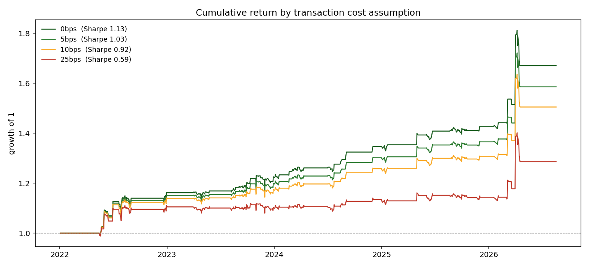

# Does WTI Brent spread mean revert enough to profit?

I test whether the spread between WTI and Brent is cointegrated and
estimate how quickly it closes, andthen check whether a mean reversion rule
is profitable after transaction costs.

The backtest returns a net Sharpe of 0.92 out of sample after 10bps costs,
against 0.26 when buying and holding WTI. Decomposing the P&L shows that
94% is earned on the 4.8% of days when the futures contracts roll
and other financial instruments close. Remove those days out, Sharpe is −0.21.


---

## Why

WTI and Brent are two grades of crude oil. They differ in sulphur,
density and delivery, whilst being close substitutes, therefore
prices are influenced by the same supply and demand. Therefore the gap
between them should be temporary rather than permanent
when it widens without it should close again.

The trade is to profit from the spread. Buy the cheap grade, sell the
expensive one, in the proportion to the hedge ratio. If crude rises,
both move together and largely cancel the position is a trade on the gap.

**Why cointegration and not correlation** 
Correlation measures how closely two assets returns move together,
but it does not tell if the difference between their
price levels will get closer. 2 assests could have similar returns
and their prices continue to move further apart over time. 
Cointegration, highlights the long-term relationship between price levels, 
highlighting if they share a trend. 


---

## Method

| Step | What I do |
|---|---|
| Transform | Log prices differences are percentage returns |
| Cointegration | Engle Granger, WTI regressed on Brent |
| Hedge ratio | The OLS slope β estimated on the training window  |
| Reversion speed | AR(1) fit on the spread, giving a half-life τ |
| Signal | Rolling z-score of the spread, window = 5τ capped to [30, 120] days |
| Rules | Enter at \|z\|>2, exit at \|z\|<0.5, stop at \|z\|>3.5, time stop at 3τ |
| Costs | 0 / 5 / 10 / 25 bps one-way |
| Split | Estimate on 2016–2021, trade 2022 onwards, 1 day execution lag |

The maths is written out in [METHODOLOGY.md](METHODOLOGY.md).

---

## Results

Estimated on 2016–2021, traded on 2022-01-03 to 2026-08-16 (1,160 days).

- Hedge ratio β = **1.020** 
- Half-life = **13.5 trading days** → z-score 67 days

| One-way cost | Gross Sharpe | Net Sharpe | Total return | Max drawdown | Trades |
|---|---|---|---|---|---|
| 0bps  | 1.13 | 1.13 | 67.1% | −7.8% | 26 |
| 5bps  | 1.13 | 1.03 | 58.6% | −7.9% | 26 |
| 10bps | 1.13 | 0.92 | 50.5% | −8.0% | 26 |
| 25bps | 1.13 | 0.59 | 28.6% | −8.3% | 26 |

Buy and hold WTI: Sharpe 0.26, total return 11.0%, max drawdown −55.3%.

the strategy is still positive at 25bps, whilst the strategy is in the market only 29% oftrading days,
and max drawdown is 8% against 55% for holding. 
Win rate is 92% on 26 trades.


Win rate seemed too high therefore I checked further.



One day carries a large share of the whole result (early 2026).

---

## Why the result is not real

The single best day, 2026-04-01, is 27.5% of P&L.
The best five days are 64.1%. An Alpha producing strategy
returns are constiently spread.

front-month futures,when a contract expires the series jumps to the next one.
That jump is for accounting not a price move. Splitting the sample on whether a day is the
first trading day of a month:

| | Month-start days | All other days |
|---|---|---|
| Share of sample | 4.8% (56 days) | 95.2% (1,105 days) |
| **Share of gross P&L** | **94.0%** | **6.0%** |
| Mean daily | 0.0181 | 0.0038 |

The spread moves 4.8× more on roll days and 8 of the 20 largest spread
movesin the sample fall on them.

**What is left without them.** 
Setting every start of the month return to zero 
shows that the jump was not obtainabe:

| | With roll days | Roll days zeroed |
|---|---|---|
| Net Sharpe (10bps) | 0.92 | **−0.21** |
| Total return | 50.5% | **−5.8%** |
| Annualised return | 9.3% | **−1.3%** |
 
On tradeable days the strategy loses.

Trade,the entry on 31 March 2026 and
the profit the next day:

| Date | spread | z | position | gross return |
|---|---|---|---|---|
| 2026-03-31 | −0.2489 | −3.36 | enters long | |
| 2026-04-01 | −0.1014 | **+2.25** | long | **+14.8%** |

The spread moved 15% and the z-score went from −3.4 to +2.3.
Oil Market did not change just the contract rolled forward.

`src/diagnostics.py` runs this, step 8 on the pipeline.

### Two further caveats

**WTI does not pass I(1) precondition.**
During the training period, Augmented Dickey Fuller(ADF) test rejects the hypothesis
for WTI levels at 5% significance level (p = 0.026),  result for Brent is not significant (p = 0.067).
A p-value above 0.05 does not provide sufficient evidence to reject the hypothesis,
the results do not clearly confirm that both series are I(1). 
The cointegration requires both to be I(1), this is not 100% satisfied.


**The cointegration evidence at 5%.** 
WTI on Brent, p = 0.026 while the reverse regression gives p = 0.052.

---

## Two ways this could have gone wrong


**Using information I would not have had at the time.** 
The z-score is calculated using most recent data, not the whole data set therefore
standardising the full data set mean and standard deviation.
 

**Trading at a unobtainable price .**
A signal from the close of day *t*
is traded at the close of day *t+1*. Positions are lagged one day before being
applied and costs are charged on the day the position actually
changes rather than the day of tje signal.

The hedge ratio β is estimated on the training window and then held.
The test period does not influence any measure/parameter.

---

## Checking the code is right

The problem with a project like this is that on real data 
the true hedge ratio or half-life is unknown, a wrong estimator looks
like a real result. `tests/test_synthetic.py` builds two series that are
cointegrated , with a β and a half-life I picked.
It runs a negative control test to ensure does not produce similar result on two unrelated random
walks, which must fail the cointegration test, and to check the stoploss
does not enter the trade it exited.

```bash
python tests/test_synthetic.py
```

---

## Running it

```bash
pip install -r requirements.txt
```

```bash
python tests/test_synthetic.py
```

```bash
python run_analysis.py
```

Charts, the daily backtest, the cost sweep and a summary table are written to
`results/`.

---

## Layout

```
├── README.md
├── METHODOLOGY.md          the maths written out
├── run_analysis.py         runs everything end to end
├── src/
│   ├── data.py             download, align, split
│   ├── stats.py            unit root tests, cointegration, half-life
│   ├── backtest.py         signal, P&L, costs, metrics
│   ├── diagnostics.py      roll attribution -- the part that kills the result
│   └── plots.py            the three charts
├── tests/
│   └── test_synthetic.py   checks the estimators on data with a known answer
└── results/                output (created on first run)
```

---

## What this does not do

1. **Futures** continuous contracts would fix this (next improvement)
2. **No financing costs** 
3. **No slippage and no market impact.** 
4. **A fixed hedge ratio.** β was estimated one time. `results/fig3_beta.png` shows
   how much β moves over the sample.

## Next steps

- Continuous contracts to see if model survives when jumps are removed
- Let β drift instead of fixed β
- Allow different reversions depending on regime
- Model other energy instruments

---

*Written in Python with AI assistance on the implementation of the code. The question,
the method, the validation design and the interpretation are mine.*
